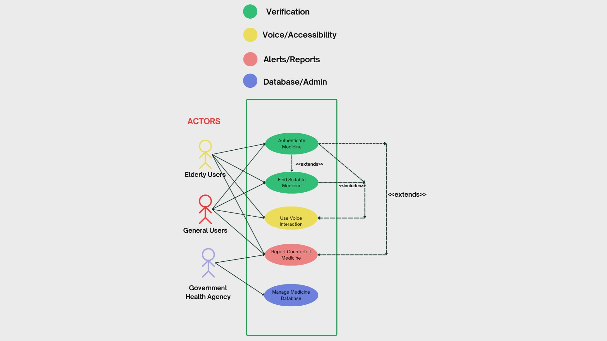
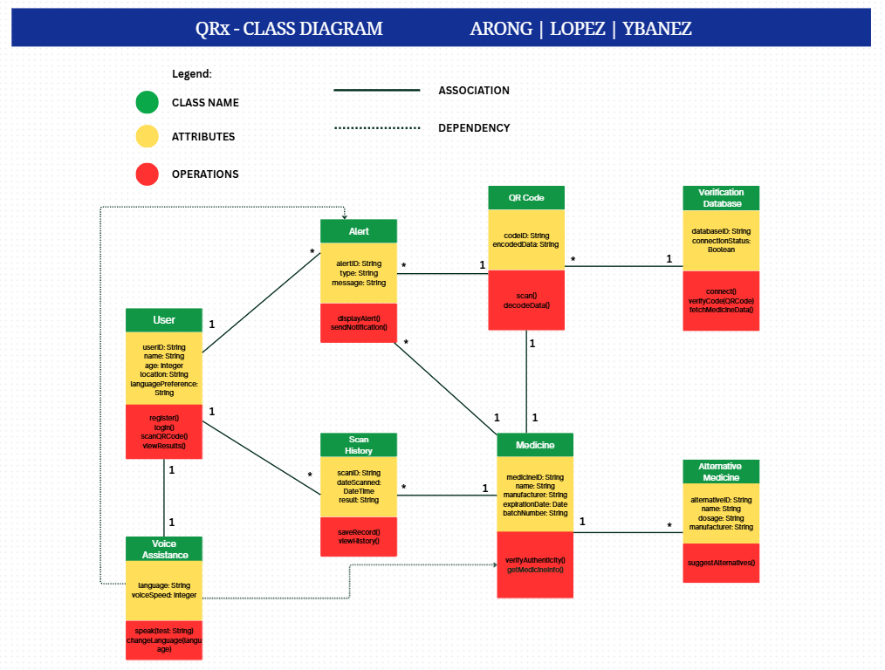

# QRx

QRx is a web-based and mobile-friendly application designed to help users verify the authenticity of their medicines using QR codes. By simply scanning the QR code on a medicine’s packaging, QRx checks the product details against a trusted database to confirm if it’s genuine or potentially counterfeit. The project aims to promote safe medicine consumption and protect consumers from fake or unsafe pharmaceutical products.

## QRx Design Artifacts

UML Diagram:

Class Diagram:

## Team QRx

 **Member Name**             |                                **Contributions**                        
--------------------------------------------------------------------------------------------------------------------
**Alessa Arong**            - Updated README.md with project description and UML/Class Diagram images • Added “QRx Design Artifacts” section and adjusted image labels and alignment • Integrated improved login UI, text updates, and multilingual support

**Allain James Ybañez**     - Added QRx folder with source files • Built initial login page (index.html) • Added and updated basic and responsive styling in style.css • Structured and refined HTML layout for the login page • Improved front-end design and visual presentation

**Mary Vincent Lopez**      - Added script.js for login form validation • Implemented “Remember Me” checkbox in login form • Uploaded example_loginsystem.png design diagram • Contributed to user interaction improvements in login module

